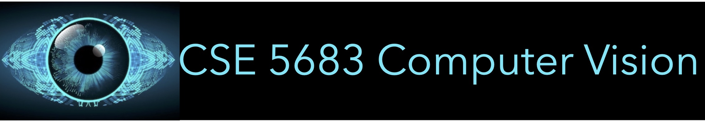

# 

### Topics

1. **Introduction**

   1. Programming environment (Python notebook, OpenCV, Matlab, LaTeX) 

2. **Image and video representation**

   1. Gray-level images
   2. Color images
   3. Videos

3. **Model-fitting and parameter estimation**

   1. Linear least-squares estimation
   2. Nonlinear least-squares estimation

4. **Image formation: The pinhole camera model**

   1. The pinhole camera
   2. Imaging 3-D objects 
   3. Imaging planar objects

5. Camera calibration

6. 

   

