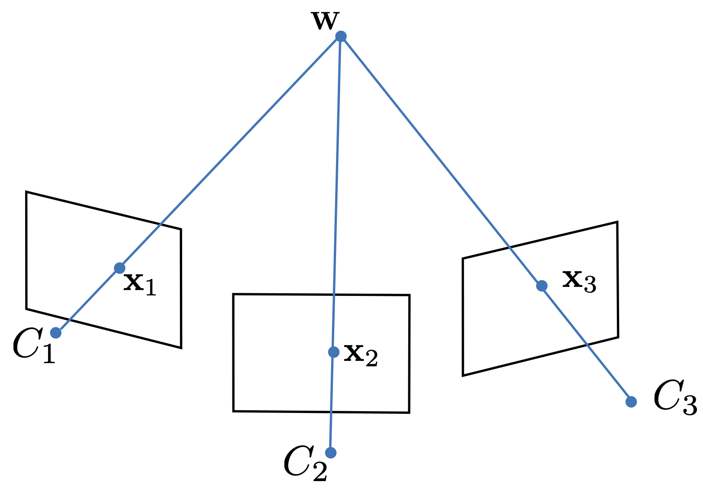

## Inferring 3-D world points

#### Overview

In this assignment, you will write an algorithm to estimate the coordinates of a 3-D point whose image has been captured by multiple cameras (i.e., multiple views). This multi-camera setup is illustrated in Figure 1 for a three-camera rig.

**Figure 1**: Three-camera capture setup.  A world point ${\bf w} \in \R^3$ is imaged by three cameras from different viewpoints. Point ${\bf x}_{j} \in \R^2$ is the image of the 3-D point through the $j$$^{th}$ camera.

The algorithm's input are the pixel coordinates of the image points corresponding to the 3-D point in each camera and the camera-calibration data describing the cameras. Here, you will use an approach that assumes that both the intrinsic and extrinsic parameters of the cameras are known (i.e., $\Lambda$, $\Omega$, and $\boldsymbol{\tau}$ are known). 

#### The camera rig

You will use the camera setup and images from the Soldiers dataset (https://www.epfl.ch/labs/cvlab/data/soldiers-tracking/) from the previous assignment. The dataset provides camera-calibration matrices for six cameras, i.e., matrices $\Lambda_j$, $\Omega_j$, and $\boldsymbol{\tau}_j$ for $j=1,\dots,6$ are known. The pinhole model for the *j*$^{th}$ camera is: 
$$
{\bf x}_{j} = \text{pinhole}\left[{\bf w}, \Lambda_j,\Omega_j,\boldsymbol{\tau}_j\right].
\label{eq_pinhole}
$$
For each world point ${\bf w}\in \R^3$, the pinhole-camera model generates an image point ${\bf x}_{j}\in \R^2$. In matrix form (in homogeneous coordinates), the pinhole-camera model is written as:
$$
\begin{align}    
    \lambda
    \begin{bmatrix}
        x_{j} \\
        y_{j} \\
        1
    \end{bmatrix}
    =  
    \underbrace{\begin{bmatrix}
        {\phi_x}_j & {\gamma}_j & {\delta_x}_j & 0 \\
         0     & {\phi_y}_j & {\delta_y}_j & 0 \\
         0     & 0      & 1        & 0 
    \end{bmatrix}}_{\text{intrinsic matrix for camera $j$}}
    \underbrace{\begin{bmatrix}
        {\omega_{11}}_j & {\omega_{12}}_j & {\omega_{13}}_j & {\tau_x}_j \\
        {\omega_{21}}_j & {\omega_{22}}_j & {\omega_{23}}_j & {\tau_y}_j \\
        {\omega_{31}}_j & {\omega_{32}}_j & {\omega_{33}}_j & {\tau_z}_j \\
         0          & 0           & 0           & 1 
    \end{bmatrix}}_{\text{rigid motion of camera $j$}}
    \begin{bmatrix}
        u \\
        v \\
        w \\
        1
    \end{bmatrix}, 
    \label{pinhole_matrix}
\end{align}
$$
or in short:
$$
\begin{align}
    \lambda \tilde{{\bf x}}_{j} = 
    \Lambda_j
    \begin{bmatrix}
        \Omega_j & {\boldsymbol{\tau}_j}
    \end{bmatrix} \tilde{{\bf w}}. 
\end{align}
$$

#### Estimation method

To estimate the coordinates of ${\bf w}\in \R^3$, you will use the approach described in Section 14.6 (Prince). Here, you want to study the whole section in the book before attempting to implement your algorithm. The solution is a geometric triangulation of all viewing rays that connect the cameras' centers to the world point through the image points. Algebraically, the solution is given by solving Equation $\ref{triangulation}$ (i.e., Equation 14.42 in Prince's book), which is a linear system of equations of the type $A{\bf w} = b$. This system of equations    provides two linear constraints on the unknown quantity ${\bf w} = \left(u,v,w\right)^\mathsf{T}$. 
$$
\begin{align}
    \begin{bmatrix}
        {\omega_{31}}_j x^\prime_{j} - {\omega_{11}}_j & {\omega_{32}}_j x^\prime_{j} -{\omega_{12}}_j & {\omega_{33}}_j x^\prime_{j} - {\omega_{13}}_j \\
        {\omega_{31}}_j y^\prime_{j} - {\omega_{21}}_j & {\omega_{32}}_j y^\prime_{j} -{\omega_{22}}_j & {\omega_{33}}_j y^\prime_{j} - {\omega_{23}}_j 
    \end{bmatrix}
    \begin{bmatrix}
        u \\
        v \\
        w 
    \end{bmatrix}
    = 
    \begin{bmatrix}        
    	{\tau_x}_j - {\tau_z}_j x^\prime_{j} \\        
    	{\tau_y}_j - {\tau_z}_j y^\prime_{j} \\          
    	\end{bmatrix}.    
    	\label{triangulation}
\end{align}
$$
Note that Equation $\ref{triangulation}$ uses *normalized* image coordinates as input, and not the standard image coordinates (See formulation in Section 14.6 of Prince's book). Normalized image coordinates are obtained by multiplying  the standard pixel coordinates by the inverse of the intrinsic matrix . 

Equation $\ref{triangulation}$ accounts for the relationship between the unknown 3-D point ${\bf w}$ and its corresponding image point ${\bf x}$ for a single camera. To estimate the values of the three coordinates of ${\bf w} = \left(u,v,w\right)^\mathsf{T}$, we need more than two constraints (i.e., the number of equations in the system of equations). Thus, we add more constraints to the equation by detecting points ${\bf x}_j$ corresponding to the same 3-D point ${\bf w}$ in the images captured by other cameras. 

To simplify the notation, let us re-write Equation $\ref{triangulation}$ as follows: 
$$
\begin{align}
    \begin{bmatrix}
        a_j & b_{j} & c_{j} \\
        d_{j} & e_{j} & f_{j}  
    \end{bmatrix}
    \begin{bmatrix}
        u \\
        v \\
        w 
    \end{bmatrix}
    = 
    \begin{bmatrix}        
    	g_j \\        
    	h_j \\          
    	\end{bmatrix}.    
    	\label{triangulationSimpler2}
\end{align}
$$
The updated system of equations (with more constraints) for $J$ cameras is:
$$
\begin{align}
    \begin{bmatrix}
        a_1 & b_{1} & c_{1} \\
        d_{1} & e_{1} & f_{1}  \\
        a_2 & b_{2} & c_{2} \\
        d_{2} & e_{2} & f_{2}  \\
				\vdots & \vdots & \vdots\\
        a_J & b_{J} & c_{J} \\        
        d_{J} & e_{J} & f_{J}
    \end{bmatrix}
    \begin{bmatrix}
        u \\
        v \\
        w 
    \end{bmatrix}
    = 
    \begin{bmatrix}        
    	g_1 \\        
    	h_1 \\
    	g_2 \\        
    	h_2 \\          
			\vdots\\
    	g_J \\        
    	h_J \\                
    	\end{bmatrix},    
    	\label{triangulation3}
\end{align}
$$
or for short: 
$$
\begin{align}
   A {\bf w} = {\bf b}, 
    	\label{triangulationSimpler4}
\end{align}
$$
which can be solved for  ${\bf w} = \left(u,v,w\right)^\mathsf{T}$ in the least-squares sense (read Prince's book Appendix C.7.1). The solution is given by: 
$$
\begin{align}
   \hat{\bf w} = A^{\dagger}{\bf b}, 
    	\label{w_solution}
\end{align}
$$
where  $ A^{\dagger}$ is the Moore-Penrose pseudo inverse of matrix $A$. The pseudo-inverse is a generalized inverse. For a nice tutorial on the pseudo inverse and its use for least squares problems go to https://mathformachines.com/posts/least-squares-with-the-mp-inverse.  For a tutorial of solving (linear) least-squares regression in Python using the pseudo inverse see https://pythonnumericalmethods.berkeley.edu/notebooks/chapter16.04-Least-Squares-Regression-in-Python.html. For a tutorial in Matlab, see https://www.mathworks.com/help/matlab/ref/pinv.html. 

#### Measurements

Detect a set of image points as seen by each camera. For a given camera, it is convenient to store the coordinates of all image points in two separate matrices, one for the *x*-coordinates and the other for the *y*-coordinates, i.e.:
$$
\begin{align}
X = 
\begin{bmatrix}
	x_{11} & x_{12} & \dots & x_{1J}\\
	x_{21} & x_{22} & \dots & x_{2J}\\  
	\vdots & \vdots & \ddots& \vdots\\
	x_{N1} & x_{N2} & \dots & x_{NJ}  
\end{bmatrix}
\,\,\,\,\,\,\text{and}\,\,\,\,\,\, 
Y = 
\begin{bmatrix}
	y_{11} & y_{12} & \dots & y_{1J}\\
	y_{21} & y_{22} & \dots & y_{2J}\\  
	\vdots & \vdots & \ddots& \vdots\\
	y_{N1} & y_{N2} & \dots & y_{NJ}  
\end{bmatrix}
\label{features}
\end{align}
$$
Here,  ${\bf x}_{ij} = \left(x_{ij},y_{ij}\right)$ are the coordinates the *i*$^{th}$ image point (i.e., image feature) in the *j*$^{th}$ camera. For this assignment, you can pick the coordinates of the image features manually using functions such as Matlab's `ginput()` or its Python equivalent.  Figure 2 shows an example of selected features for two objects in the scene seen by three cameras. 

**Figure 2**: Features detected on three cameras. Each image feature is labeled and corresponds to the same 3-D point in the scene. In this case, the features were selected clockwise. 

#### Sensitivity analysis

In addition to determining the coordinates of the 3-D point, you will also produce a simple analysis of the accuracy of the 3-D reconstruction. The analysis will be based on a measure of the pixel re-projection error.  Figure 3 illustrates the concept of reproduction for the case of three cameras. 

**Figure 3**: Re-projection error for a given 3-D point captured by three cameras. The coordinates of point $\hat{\bf w} \in \R^3$ is the *estimated* location of the point in space. Point ${\bf x}_{j} \in \R^2$, is the projection of the 3-D point through the $j$-th camera. The process to estimate $\hat{\bf w}$ uses the pixel coordinates ${\bf x}_{j}$ for $j=1,\dots,3$ as input. Given the estimated 3-D point  $\hat{\bf w}$, we can then *re-project* it onto each camera using the camera models. The re-projected pixel coordinates are given by $\hat{\bf x}_{j}$. The error between the measured pixel coordinates ${\bf x}_{j}$ and the re-projected pixel coordinates $\hat{\bf x}_{j}$ is called the *re-projection error*. 

Now that you have your estimated 3-D points and the estimation method at hand, plot the re-projection error for increasing levels of noise added to the input pixel coordinates. The re-projection error is given by: 
$$
\begin{align}
E = \sum_{i=1}^M \sum_{j=1}^N \|{\bf x}_{ij} - \hat{\bf x}_{ij}\|^2,
\label{reprojectionError}
\end{align}
$$
where $\|\cdot\|$ is the Euclidean norm, and $\hat{\bf x}_{ij}$ is calculated using Equation $\ref{eq_pinhole}$ given the estimated 3-D points $\hat{\bf w}_j$ as input, i.e., run the estimated points $\hat{\bf w}_j$ through the same cameras to generate the corresponding $\hat{\bf x}_{ij}$.

#### Implementation suggestions

The main function to be implemented in this assignment are: 

-  $\hat{\bf w}_{i} \leftarrow \textsf{estimated3Dpoint}\left({\bf x}_{ij}, \Lambda_j,\Omega_j,\boldsymbol{\tau}_j\right)$, where ${\bf x}_{ij}$ is an array containing the coordinates of the image point corresponding to ${\bf w}_i$ on the $j$$^{}$ camera.  This function is called once for each world point that is estimated. 
- $\textsf{plotReconstructedObject}\left(\hat{\bf w}_1,\dots,\hat{\bf w}_M\right)$. This function displays a 3-D plot of the estimated world points linked with lines to show the reconstructed object in 3-D. 
- $\textsf{E = reprojectionError}\left(\hat{\bf w}_1,\dots,\hat{\bf w}_M, X, Y,\Lambda_1,\Omega_1,\boldsymbol{\tau}_1,\dots,\Lambda_J,\Omega_J,\boldsymbol{\tau}_J \right)$ for $J=6$. The arrays $X$ and $Y$ contain the $x$ and $y$ coordinates of the detected image features (Equation $\ref{features}$). The reproduction error is calculated using Equation $\ref{reprojectionError}$.

#### Deliverables

A brief report containing the following: 

- The code of your solution 
- The estimated 3-D coordinates for each scene point $\hat{\bf w}_j$ 
- The re-projection error 
- A 3-D plot of the objects formed by the 3-D points (e.g., table top and calibration pattern as points linked by lines). Display the 3-D plot at a couple of angles that show the difference between the two objects in three dimensions. 

You should make an effort to produce the report in Jupyter notebook, with equations in LaTeX, and your own observations. 

<iframe width="100%" height="800" src="princes_Algorithms_14.3.pdf">
